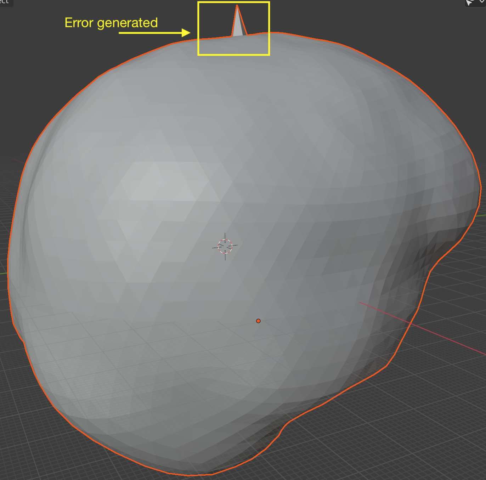
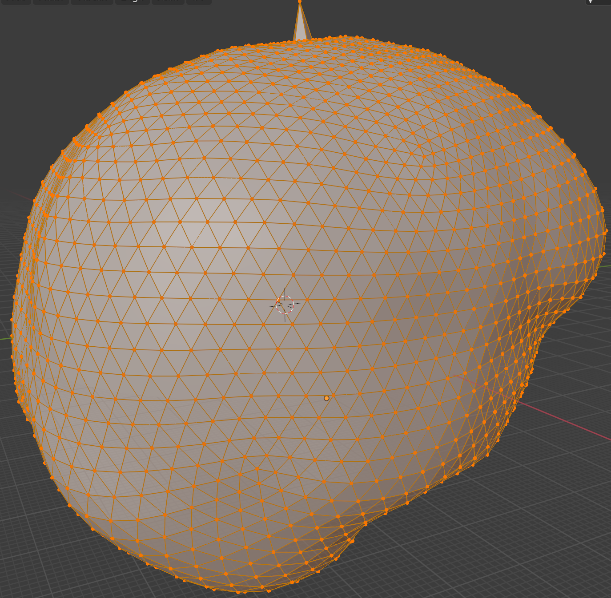
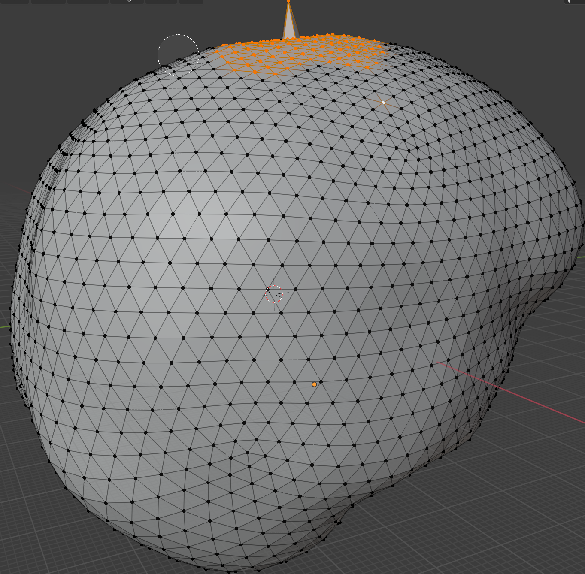
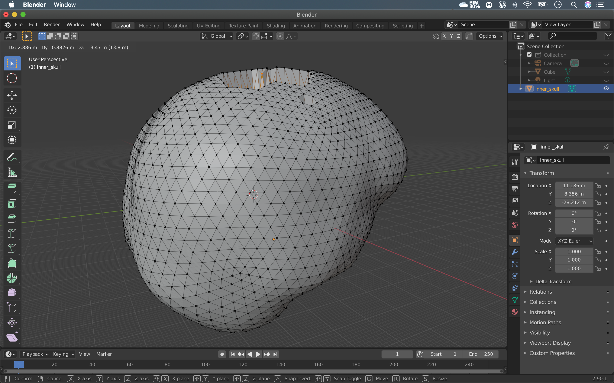
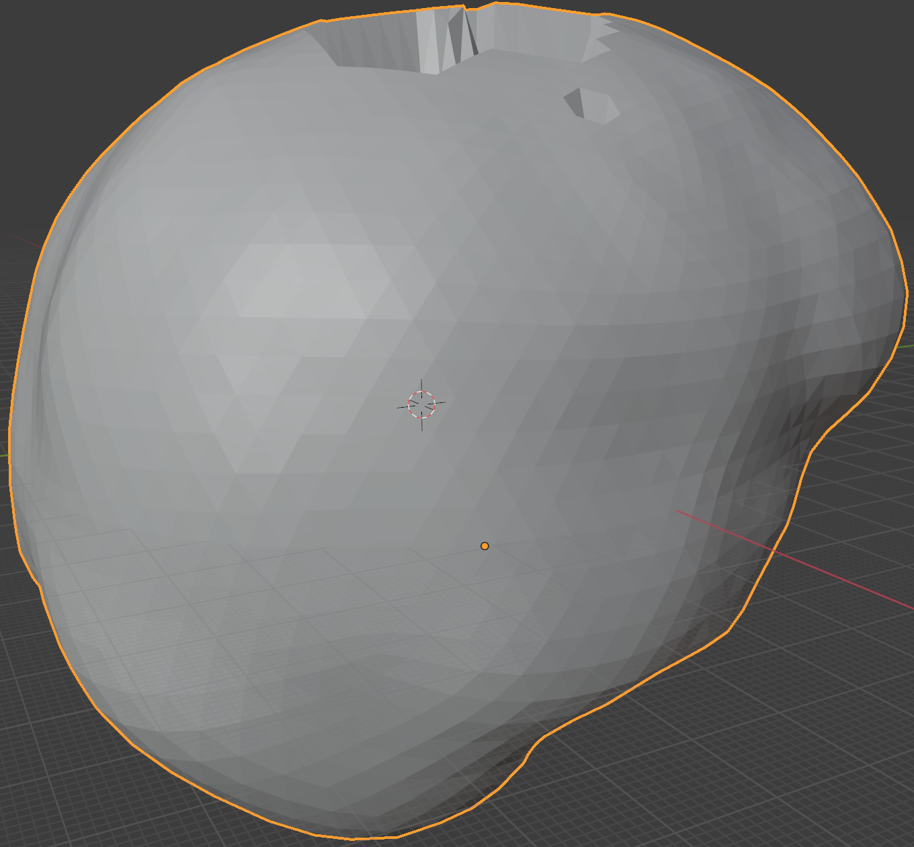

# 3-Layer-BEM-model


Dataset: DS117 (run 00-fetch_data.py to download the dataset)

Main Python packages:

*  Free Surfer version 6.0.0
*  MNE 0.21.0 

OS System: Mac Os X (Big Sur 11.1)


Important Note: 

It is more reliable to work with MEG data rather than EEG data in this dataset. Furthermore, if you want to create a 3-layer BEM model, you will find some problems, such as the intersections between surfaces (inner skin, outer skin, and outer skull). The solution is "easy" to fix with the use of Blender software. 


## Repairing intersections between surfaces in Blender:

1.- To see the existence of intersections, please go to the Jupyter notebook named "01-check_surfaces_and_plots".

```python
check_surfaces(subject_id = 6)
```

2.- Then go to "01-edit_bem_surfaces" and transform the bad surfaces previously generated (.surf) to .obj format. 

```python
coords, faces = mne.read_surface(op.join(bem_dir, 'outer_skull.surf'))
mne.write_surface(op.join(conv_dir, 'outer_skull.obj'), coords, faces,
                  overwrite=True)
```
```python
coords, faces = mne.read_surface(op.join(bem_dir, 'inner_skull.surf'))
mne.write_surface(op.join(conv_dir, 'inner_skull.obj'), coords, faces,
                  overwrite=True)
 
```
 ```python                 
 coords, faces = mne.read_surface(op.join(bem_dir, 'outer_skin.surf'))
mne.write_surface(op.join(conv_dir, 'outer_skin.obj'), coords, faces,
                  overwrite=True)

```
Note: All the *.obj* files will be saved inside the *Conv* folder. 

## Import and Export surfaces 
You can find both options in the *File option*. 

3.- Go to Blender and import (select the Keep Vert Order and Y Forward option, save these settings with +) the .obj file to edit it.

4.- Once fixed the surface, export it (e.g., outer_skull_fixed.obj). Choose *Y Forward option* and check the *Keep Vertex Order box*.

5.- Finally, go again to *01-edit_bem_surfaces*, read, and see the modifications. 
 
 ```python 
# Read the fixed surface
coords, faces = mne.read_surface(op.join(conv_dir, 'outer_skull_fixed.obj'))

# Backup the original surface
shutil.copy(op.join(bem_dir, 'outer_skull.surf'),
            op.join(bem_dir, 'outer_skull_orig.surf'))


# Overwrite the original surface with the fixed versionbem
mne.write_surface(op.join(bem_dir, 'outer_skull.surf'), coords, faces,
                  overwrite=True)

check_surfaces(subject)
```

## Blender

In the following image, you can observe the error previously generated.



The *tab key* will permit to change to *edit mode*.



The *C key* will activate a *circle selection mode*, and the *scroll wheel* permit 
increases or decreases it. 



The *G key* plus the *mouse's movement* will modify the form of the surface part 
previously selected.



Returning to *object mode* with the tab key, we can view the final result.



Note: It is recommendable to make minor modifications in Blender, then check the
surface plots. The idea is that you detect step by step, which parts of the surfaces to modify and eliminate the intersections between the surfaces.
